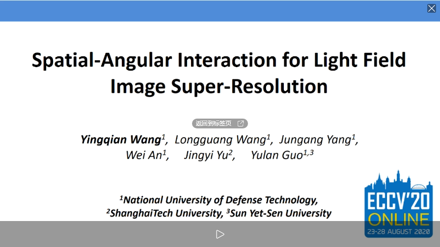
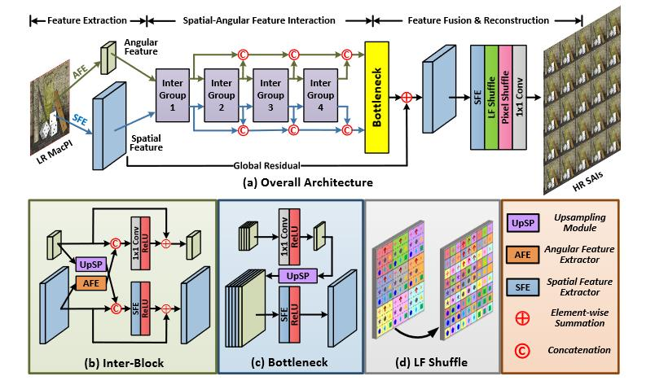

### PyTorch implementation of our [ECCV 2020](https://arxiv.org/pdf/1912.07849.pdf) paper: "Spatial-Angular Interaction for Light Field Image Super-Resolution".
<br>
<p align="center"> <a href="https://wyqdatabase.s3-us-west-1.amazonaws.com/LF-InterNet.mp4"></a> </p><br>

## News:
* **2021-12-11**: We recommend our newly-released repository [BasicLFSR](https://github.com/ZhengyuLiang24/BasicLFSR) for the implementation of our LF-InterNet. [BasicLFSR](https://github.com/ZhengyuLiang24/BasicLFSR) is an open-source and easy-to-use toolbox for LF image SR. The codes of several milestone methods (e.g., LFSSR, LF-ATO, LF-InterNet, LF-DFnet) have been implemented (retrained) in a unified framework in [BasicLFSR](https://github.com/ZhengyuLiang24/BasicLFSR).
<br>

## Network Architecture:
<p align="center">  </p><br>

## Requirement
* PyTorch 1.3.0, torchvision 0.4.1. The code is tested with python=3.7, cuda=9.0.
* Matlab (For training/test data generation and performance evaluation)

## Train
Please switch to [*LF-InterNet_train*](https://github.com/YingqianWang/LF-InterNet/tree/LF-InterNet_train) for details.

## Test
* Download the test sets and unzip them to `./data`. Here, we provide a demo test set (<a href="https://wyqdatabase.s3-us-west-1.amazonaws.com/data_demo.zip">data_demo.zip</a>) which only includes one test scene, and we also provide the full test set on [Baidu Drive](https://pan.baidu.com/s/1LfopBUF_aKvfvUhSqA2Cew) (Key: NUDT) which is used in our paper.
* Download our pretrained models (<a href="https://wyqdatabase.s3-us-west-1.amazonaws.com/log.zip">log.zip</a>) and unzip them to `./log`.
* Run `GenerateDataForTest.m` to generate test data.
* Run `test.py` to perform a demo inference. Note that, the selected pretrained model should match the generated input data and the preset network architecture. Initial results (`.mat` files) will be saved to `./results`.
* Run `evaluation.m` to calculate PSNR and SSIM scores and transform initial results (`.mat` files) into `.png` images.

## Citiation
**If you find this work helpful, please consider citing the following paper:**
```
@InProceedings{LF-InterNet,
  author    = {Wang, Yingqian and Wang, Longguang and Yang, Jungang and An, Wei and Yu, Jingyi and Guo, Yulan},
  title     = {Spatial-Angular Interaction for Light Field Image Super-Resolution},
  booktitle = {European Conference on Computer Vision (ECCV)},
  pages     = {290-308},
  year      = {2020},
}
```

## Contact
Any question regarding this work can be addressed to wangyingqian16@nudt.edu.cn.
